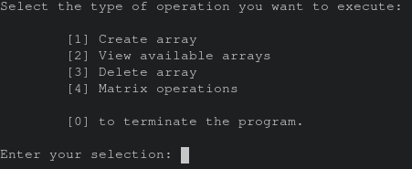
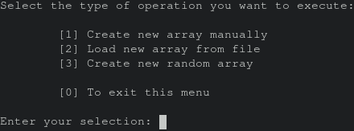
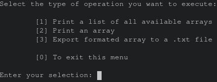
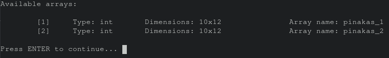
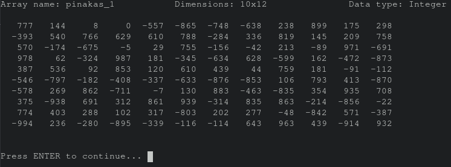
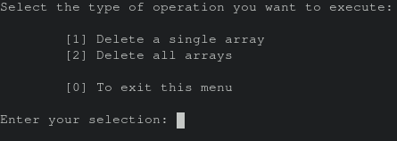
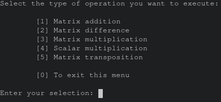

    Αριστοτέλειο Πανεπιστήμιο Θεσσαλονίκης 
    Τμήμα Ηλεκτρολόγων Μηχανικών και Μηχανικών Υπολογιστών 
    004 - Δομημένος Προγραμματισμός  
    Γερασίμου Δημήτριος

# 
 Πράξεις Μεταξύ Πινάκων

## Συμβασιμότητα
- Η κατασκευή του προγράμματος έγινε σε Arch Linux με μεταγλωτιστή τον `gcc` σε έκδοση `11.1.0` και λειτουργεί οπώς έχει σχεδιαστεί.
- Επιπρόσθετα έχει δοκιμαστεί πρόχειρα και λειτουργεί σε Windows 11 με `gcc` σε έκδοση `6.3.0-1` από την συλλογή μεταγλωτιστών MinGW.
## Χαρακτηριστικά Προγράμματος
 - Το πρόγραμα λειτουργεί με την αποθήκευση μίας συστοιχίας (`list`) τύπου δομής (`array`), όπου η κάθε καταχώριση αντιστοιχεί στα στοιχεία κάθε αποθηκευμένου πίνακα:
    - Όνομα συστοιχίας.
    - Τύπος δεδομένων:
        - Όπου 1 ακέραιοι αριθμοί.
        - Όπου 2 αριθμοί κινητής υποδιαστολής 'double'.
    - Αριθμός γραμμών συστοιχίας.
    - Αριθμός στηλών συστοιχίας.

    Τα δεδομένας της συστοιχίας αυτής αποθηκέυονται στο αρχείο `.header.txt` για την μόνιμη αποθήκευση τους σε διαφορετικές εκτελέσεις του προγράμματος.

    Οι συστοιχίες αποθηκεύονται σε ομώνυμα dotfile αρχεια (`.[όνομα].txt`).

    Αποτέλεσμα αυτών των λειτουργιών είναι η άμεση πρόσβαση λίστας με τα χαρακτηριστικά των συστοιχιών για την εκτέλεση διαφόρων εντολών και η φόρτωση των δεδομένων στην μνήμη μόνο κατά την εκτέλεση εντολών με αυτές, χωρίς την χρήση της μνήμης από άσχετες συστοιχίες.
-   Το πρόγραμμα εκτελέι όλες τις λειτουργίες (φόρτωση συστιχοιών, αποθήκευση συστοιχιών, πράξεις πινάκων) σε τύπο δεδομένων 'double'. Για ακέραιους αριθμούς οι πράξεις πάλι γίνονται σε 'double' αλλά αποθηκεύονται σαν ακέραιοι για την χρήση λιγότερου αποθηκευτικού χώρου.
-   Όλες οι εισόδοι δεδομένων τυγχάνουν έλεγχο τύπου και δεδομένων εκτός εκτός από την είσοδο δεδομένων στην συστοιχία.
## Λειτουργία Προγράμματος
-   Κατά την εκτέλεση του προγράμματος εμφανίζεται αυτός ο κατάλογος:

-   Δίνονται 5 επιλογές στον χρήστη, οπού εκτελούνται με την είσοδο ενός ακέραιου αριθμού. Αυτές είναι:
    -   0 - Τερματισμός προγράμματος.
    -   1 - Μετάβαση σε υποκατάλογο δημιουργίας συστοιχιών.
    -   2 - Μετάβαση σε υποκατάλογο προβολής συστοιχιών.
    -   3 - Μετάβαση σε υποκατάλογο διαγραφής συστοιχιών.
    -   4 - Μετάβαση σε υποκατάλογο πράξεων μεταξύ πινάκων.
### Υποκατάλογος Δημιουργίας Συστοιχιών
-   Με την επιλογή 1 στο κύριο μενού, εμφανίζεται αυτός ο υποκατάλογος:

-   Δίνονται 4 επιλογές στον χρήστη, οπού εκτελούνται με την είσοδο ενός ακέραιου αριθμού. Αυτές είναι:
    -   0 - Έξοδος υποκαταλόγου, επιστροφή στον κύριο.
    -   1 - Δημιουργία συστοιχίας με είσοδο των δεδομένων.
    -   2 - Φόρτωση συστοιχίας από αρχείο.
    -   3 - Δημιουργία τυχαίας συστοιχίας.
-   Με την επιλογή 1, ακολουθώντας τις οδηγίες στην οθόνη θα ζητηθούν και θα καταχορηθούν τα ακόλουθα στοιχεία, πρίν την εισαγωγή τον δεδομένων του πίνακα:
    -   Όνομα πίνακα
    -   Τύπος δεδομένων
    -   Αριθμός γραμμών
    -   Αριθμός στηλών
-   Με την επιλογή 2, θα ζητηθούν τα ίδια στοιχεία με την επιλογή 1, αλλα θα ζητηθεί και το όνομα του αρχείου, από το οποίο θα φορτωθεί ο πίνακας. (Πρέπει να βρίσκεται στο ίδιο directory με το εκτελέσιμο αρχείο και να περιέχει μόνο τα δεδομένα της συστοιχίας και να χωρίζονται με κενούς χαρακτήρες)
-   Με την επιλογή 3, θα ζητηθούν τα ίδια στοιχεία με την επιλογή 1, αλλα θα ζητηθεί και το ανώτατο όριο για την γεννήτρια στοιχείων. (Σημείωση, δημιουργούνται και αρνητικές τιμές)
### Υποκατάλογος Προβολής Συστοιχιών
-   Με την επιλογή 2 στο κύριο μενού, εμφανίζεται αυτός ο υποκατάλογος:

-   Δίνονται 4 επιλογές στον χρήστη, οπού εκτελούνται με την είσοδο ενός ακέραιου αριθμού. Αυτές είναι:
    -   0 - Έξοδος υποκαταλόγου, επιστροφή στον κύριο.
    -   1 - Εμφάνιση λίστας συστοιχιών.
    -   2 - Εκτύπωση δεδομένων συστοιχίας.
    -   3 - Εξαγωγή συστοιχίας σε αρχείο `.txt`.
-   Με την επιλογή 1, θα εμφανιστεί η ακόλουθη λίστα, με τα δεδομένα του αρχείου `.header.txt`:

-   Με την επιλογή 2, θα τυπωθεί η λίστα συστοιχιών και με την επιλογή μιας εκ αυτών, θα τυπωθούν τα δεδομένα της με το πάρακατω πρώτυπο:

-   Με την επιλογή 3, θα τυπωθεί η λίστα συστοιχιών και με την επιλογή μιας εκ αυτών, θα τυπωθούν τα δεδομένα της με το πρώτυπο της δεύτερης επιλογής, σε ένα ομώνυμο αρχείο `.txt`.
### Υποκατάλογος Διαγραφής Συστοιχιών
-   Με την επιλογή 3 στο κύριο μενού, εμφανίζεται αυτός ο υποκατάλογος:

-   Δίνονται 3 επιλογές στον χρήστη, οπού εκτελούνται με την είσοδο ενός ακέραιου αριθμού. Αυτές είναι:
    -   0 - Έξοδος υποκαταλόγου, επιστροφή στον κύριο.
    -   1 - Διαγραφή μίας συστοιχίας.
    -   2 - Διαγραφή όλων των συστοιχιών.
-   Με την επλιογή 1, θα τυπωθεί η λίστα συστοιχιών και μετά την επιλογή μίας εκ αυτών από τον χρήστη, θα ζητηθεί έγκριση πρίν την διαγραφή της.
-   Με την επλιογή 2, ζητά έγκριση πρίν διαγράψει όλες τις συστοιχίες.
### Υποκατάλογος Πράξεων μεταξύ Πινάκων
-   Με την επιλογή 4 στο κύριο μενού, εμφανίζεται αυτός ο υποκατάλογος:

-   Δίνονται 4 επιλογές στον χρήστη, οπού εκτελούνται με την είσοδο ενός ακέραιου αριθμού. Αυτές είναι:
    -   0 - Έξοδος υποκαταλόγου, επιστροφή στον κύριο.
    -   1 - Πρόσθεση πινάκων.
    -   2 - Αφαίρεση πινάκων.
    -   3 - Πολλαπλασιασμός πινάκων.
    -   4 - Βαθμωτός πολλαπλασιασμός.
    -   5 - Αναστροφή πίνακα.
-   Στις τρείς πρώτες επιλογές τυπώνεται η λίστα συστοιχιών, οπόυ και ο χρήστης επιλέγει 2 εκ αυτών για την εκτέλεση της πράξης, λαμβάνοντας υπόψη την σείρα που εισάγωνται. Στην συνέχεια το πρόγραμμα ελέγχει εαν είναι δυνατόν να γίνει η επιλεγόμενη πράξη και στην συνέχεια ζητά το όνομα του πίνακα στον οπόιον θα αποθηκεύσει το αποτέλεσμα.
-   Με την επιλογή 4, θα τυπωθεί η λίστα συστοιχιών και μετα την επιλογή μίας εκ αυτών από τον χρήστη, θα ζητηθεί ένας αριθμός ο οποίος μπορεί να είναι είτε ακέραιος είτε με υποδιαστολή και το όνομα της συστοιχίας όπου θα αποθηκευτεί ο πίνακας.
-   Με την επιλογή 5, θα τυπωθεί η λίστα συστοιχιών και μετά την επιλογή μίας εκ αυτών, θα ζητηθεί μόνο το όνομα της νέας συστοιχίας.